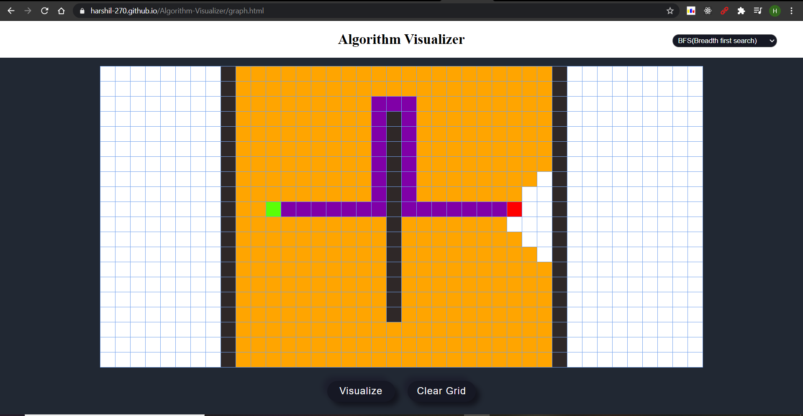
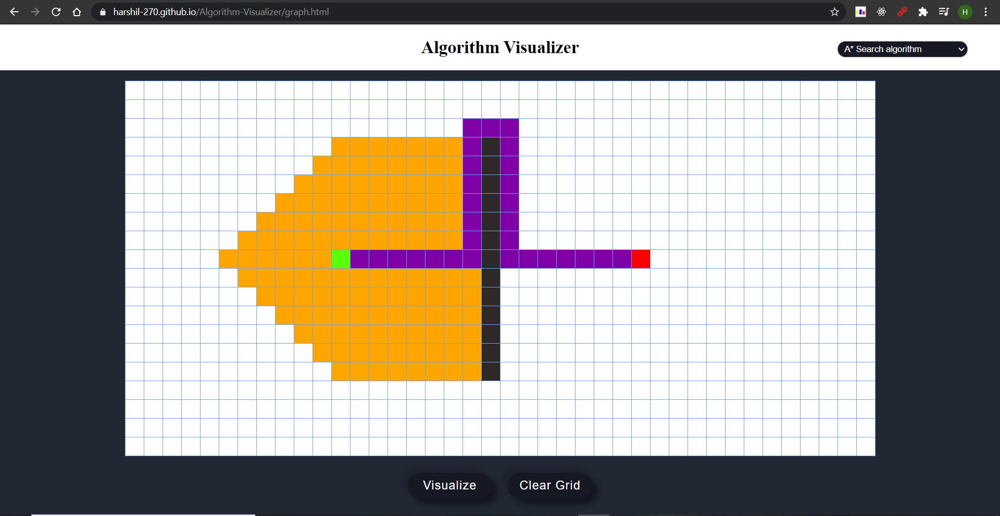
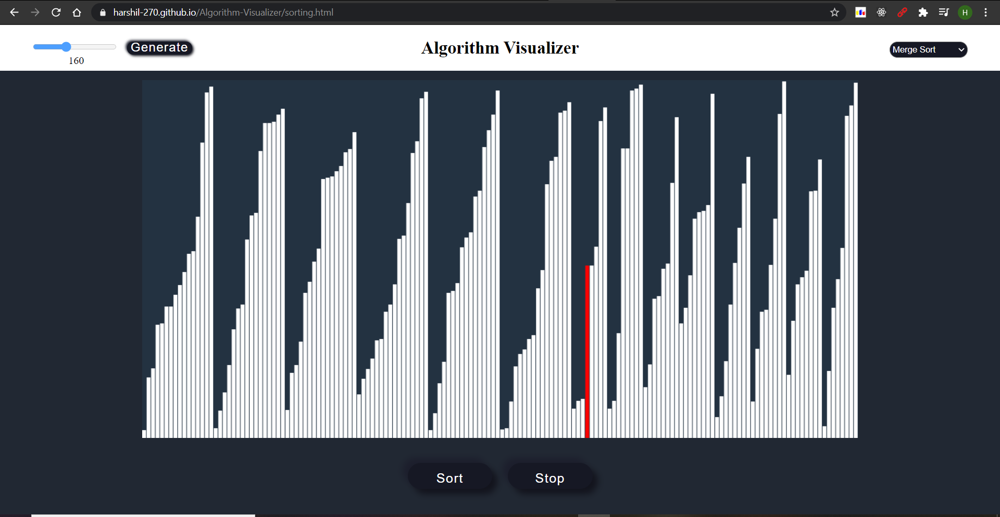
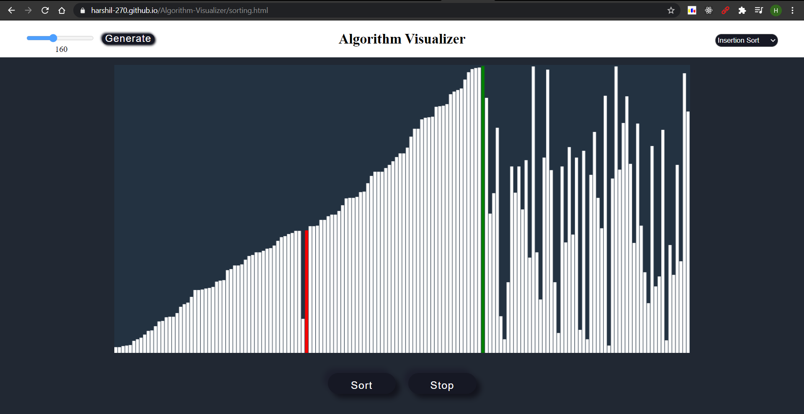

# Algorithm Visualizer

View Algorithm Visualizer
https://harshil-270.github.io/Algorithm-Visualizer/

<h3>Graph Algorithms</h3>
<ul> 
  <li>BFS(Breadth first search)</li>
  <li>DFS(Depth first search)</li>
  <li>A* Search algorithm</li>
</ul>

 
  
  

<h3>Sorting Algorithms</h3>
<ul> 
  <li>Merge Sort</li>
  <li>Quick Sort</li>
  <li>Insertion Sort</li>
  <li>Bubble Sort</li>
  <li>Selection Sort</li>
</ul>

  
  

